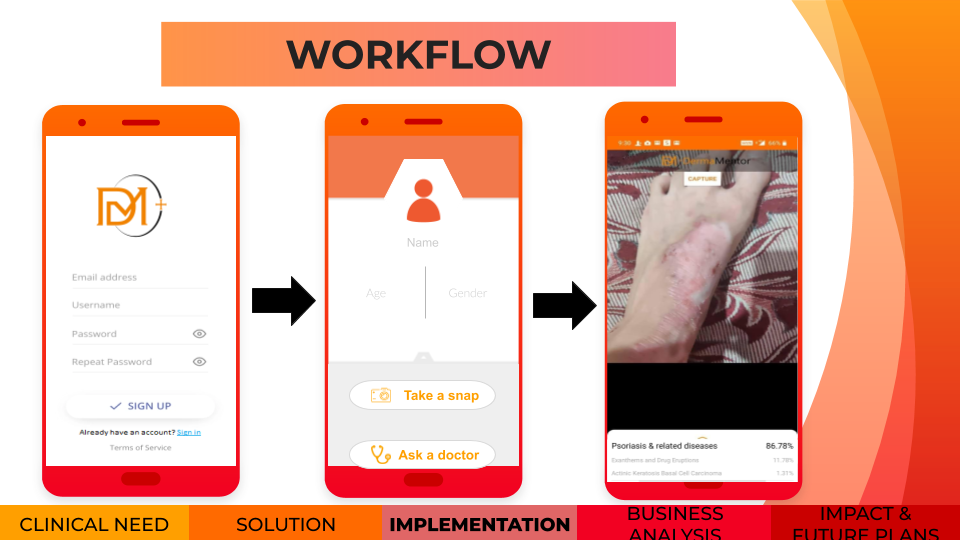
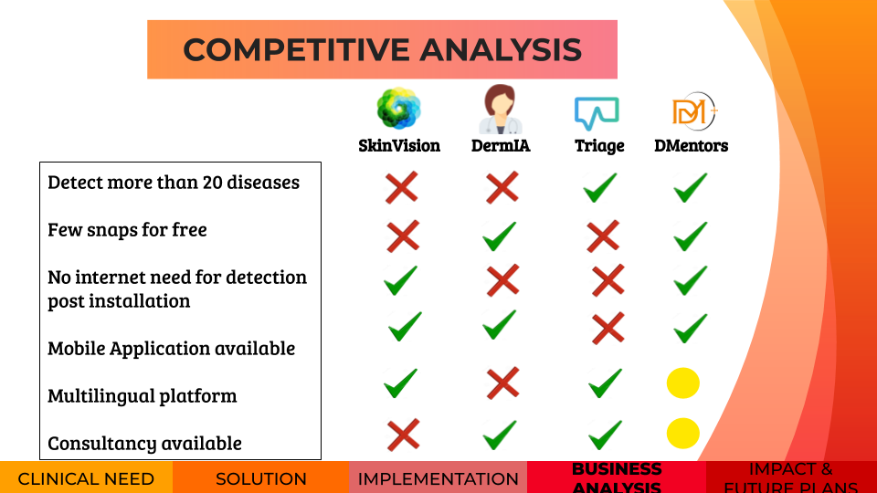
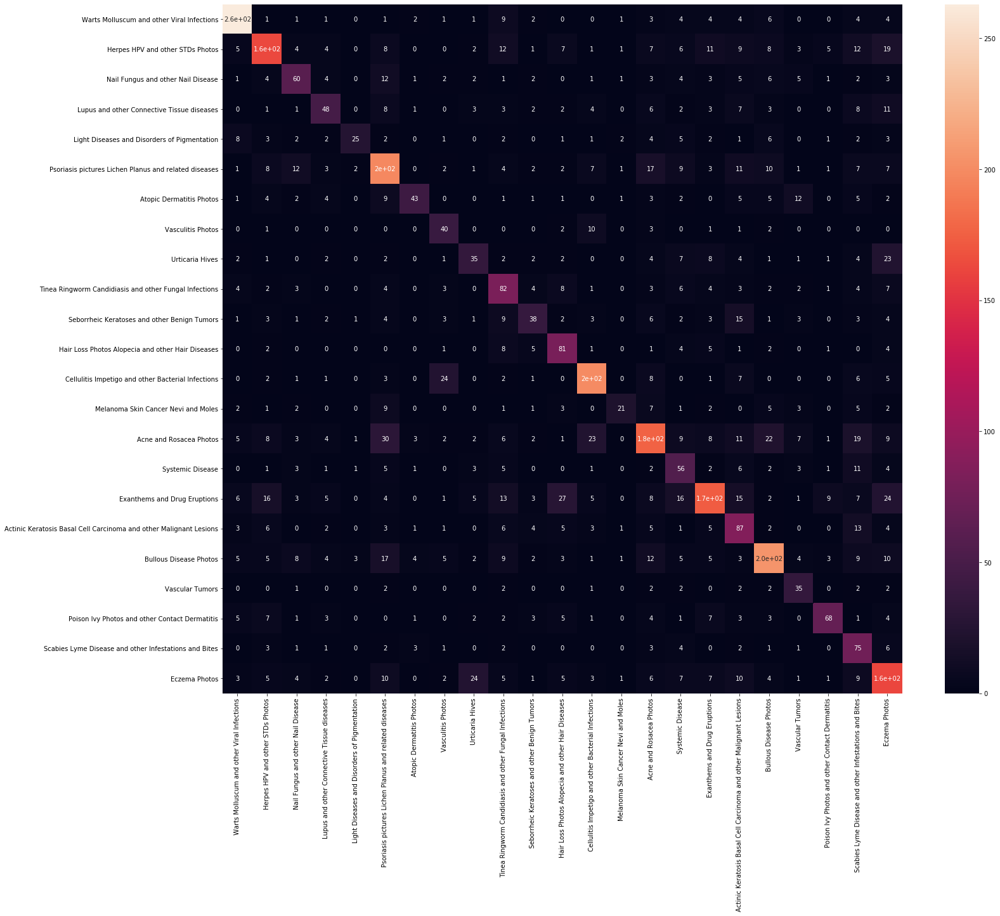
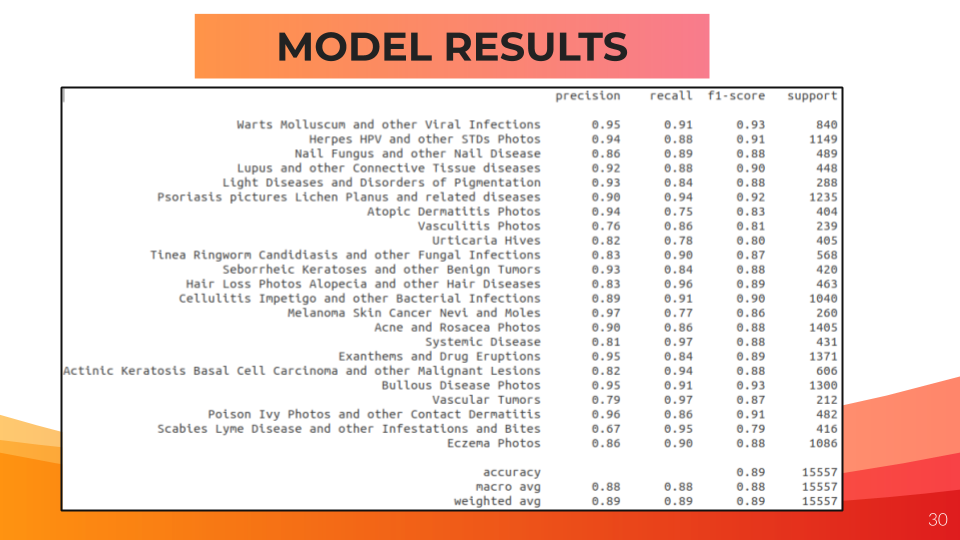

A Convolution Neural Network based Android application to classify skin disease into one of 23 types.

## Install
Download the apk from the link here : [apk_link](https://drive.google.com/open?id=1bCquFktnNjlzX6ZM1loVbqCSiCsnTNZD)

## Usage

## How is it better

## Model evaluation

## Dataset
Dataset is a scraped images of the above mentioned 23 classes.
Link to dataset : [Dataset](https://drive.google.com/open?id=1y-ogUTETRsyiEAGB0cpH_pZ8W5cAkNHS)

## Our Team

